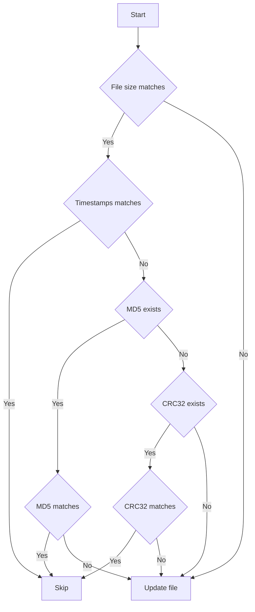

# add

Add one or more files to an existing MPQ archive.

The archive is always the first positional argument, followed by one or more files or directories.
All inputs are processed in a single open/close cycle, which is significantly faster than
calling `add` once per file.

## Add a single file

```bash
$ echo "For The Horde" > fth.txt
$ mpqcli add wow-patch.mpq fth.txt
[+] Adding file: fth.txt
```

## Add multiple files at once

Pass more than one file path after the archive. The archive is opened once for all files.

```bash
$ mpqcli add wow-patch.mpq fth.txt fta.txt fts.txt
[+] Adding file: fth.txt
[+] Adding file: fta.txt
[+] Adding file: fts.txt
```

## Add files from stdin

Pass `-` as the file argument to read paths from standard input. This works with `find`,
`ls`, or any other tool that produces file paths.

```bash
$ find . -name "*.blp" | mpqcli add wow-patch.mpq -
[+] Adding file: textures\Creature\Bear\Bear.blp
[+] Adding file: textures\Creature\Wolf\Wolf.blp
...
```

## Add a directory

Pass a directory path to recursively add all files within it. The directory structure is
preserved relative to the directory root.

```bash
$ mpqcli add wow-patch.mpq textures/
[+] Adding file: Creature\Bear\Bear.blp
[+] Adding file: Creature\Wolf\Wolf.blp
```

Use `--path` to add a prefix to every archived path:

```bash
$ mpqcli add wow-patch.mpq textures/ --path textures
[+] Adding file: textures\Creature\Bear\Bear.blp
[+] Adding file: textures\Creature\Wolf\Wolf.blp
```

## Control where files are stored

For single files, one can specify both directory and filename in one step using `-p` or `--path`:

```bash
$ mpqcli add wow-patch.mpq fts.txt --path "texts\swarm.txt"
[+] Adding file: texts\swarm.txt
```

For directories, one can specify the base directory using `-p` or `--path`:

```bash
$ mpqcli add wow-patch.mpq textures/ --path textures
[+] Adding file: textures\Creature\Bear\Bear.blp
[+] Adding file: textures\Creature\Wolf\Wolf.blp
[*] For textures: 2 files added, 0 files skipped, 0 files failed.
```

## Replacing files that already exist

`add` never replaces an archived file unless you ask it to. Two flags control what
happens when a file is already present, and they are **mutually exclusive**, passing
both is an error, because "replace everything" and "replace only what changed" are
contradictory requests.

| Flags | Behaviour when the file already exists |
| --- | --- |
| *(neither)* | Skip it and leave the archived copy alone |
| `-w`, `--overwrite` | Replace it unconditionally |
| `-u`, `--update` | Replace it only if the local file differs |

### Default: skip

Without either flag, an existing file is skipped. This is a normal outcome, not an
error, so the exit code is still `0`:

```bash
$ mpqcli add wow-patch.mpq allegiance.txt
[!] File already exists in MPQ archive: allegiance.txt - Skipping...
[*] 1 file(s) already in the archive were skipped. Use --overwrite to replace them, or --update to replace only the ones that changed.
```

### `--overwrite`: replace unconditionally

```bash
$ mpqcli add wow-patch.mpq allegiance.txt --overwrite
[+] File already exists in MPQ archive: allegiance.txt - Overwriting...
[+] Adding file: allegiance.txt
```

## Add with a locale

Use `--locale` to store the file under a specific locale. Files added without `--locale`
use the default locale.

```bash
$ mpqcli add wow-patch.mpq allianz.txt --locale deDE
[+] Adding file for locale deDE: allianz.txt
```

## Add with game-specific compression

Use `-g` or `--game` to apply the compression and encryption rules for a specific game.

```bash
$ mpqcli add archive.mpq khwhat1.wav --game warcraft2
[+] Adding file: khwhat1.wav
```

## Replace only what changed with --update

The `--update` flag replaces a file only when the local copy differs from the archived
one, and skips it otherwise. This is useful for incremental updates where only changed
files need to be re-added. It applies to single files and directories alike, the
comparison is always made per file.

The skip decision follows this chain:

1. **File size** must match. If the sizes differ the file is always re-added.
2. If the sizes match, the archive's `(attributes)` file is consulted:
   - **Timestamp** – if the archive stores file timestamps, the local file's
     last-modification time is compared at one-second resolution. A match skips the file.
   - **MD5** – if the timestamp did not match or is unavailable, and the archive stores MD5
     checksums, the MD5 of the local file is computed and compared. A match skips the file.
   - **CRC32** – if neither timestamp nor MD5 produced a match or was available, and the
     archive stores CRC32 checksums, those are compared. A match skips the file.
   - **No attributes** – if the archive has no `(attributes)` file, the file is always
     re-added even when sizes match, because no reliable content check is possible.

Note: a timestamp match alone skips the file, without comparing checksums. A file whose
content changed but whose size and modification time were both preserved (for example by
`cp -p` or tools that restore timestamps) will therefore not be detected as changed. This
is the same trade-off tools like `rsync` make by default. If exact change detection
matters, use `--overwrite` instead of `--update` to unconditionally replace every file.

```bash
$ mpqcli add wow-patch.mpq textures/ --update
[~] Skipping unchanged file: Creature\Bear\Bear.blp (MD5 matches)
[+] File already exists in MPQ archive: Creature\Wolf\Wolf.blp - Overwriting...
[+] Adding file: Creature\Wolf\Wolf.blp
[*] For textures: 1 files added, 1 files skipped, 0 files failed.
```

The same comparison applies when the target is a single file:

```bash
$ mpqcli add wow-patch.mpq allegiance.txt --update
[~] Skipping unchanged file: allegiance.txt (MD5 matches)
```

Flow chart of update method:


